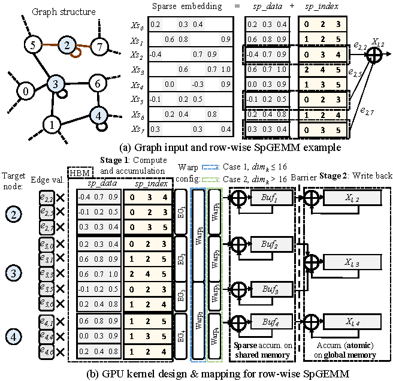
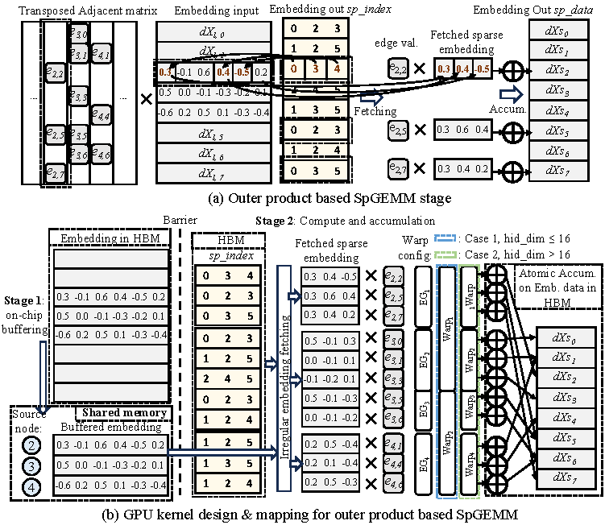
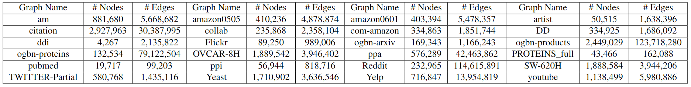
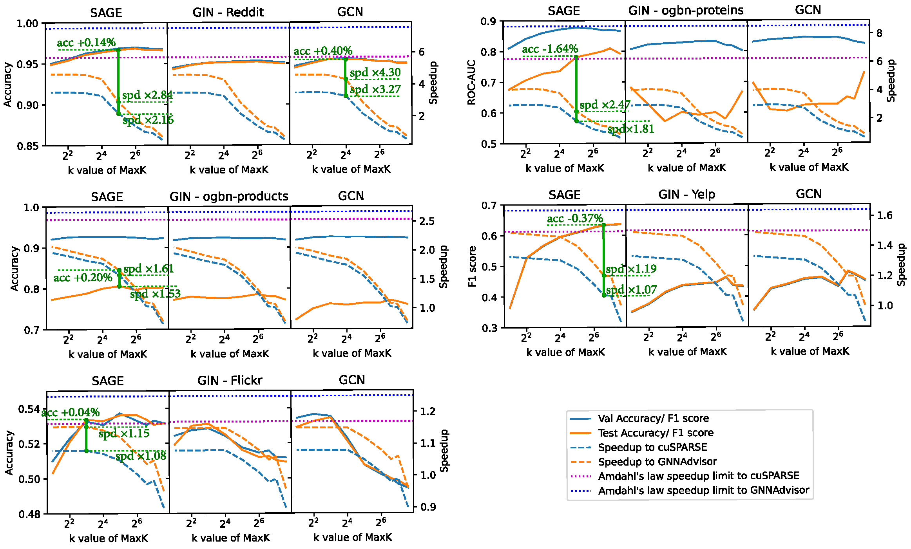

## Official implementation of "MaxK-GNN: Extremely Fast GPU Kernel Design for Accelerating Graph Neural Networks Training"

Please cite our paper if you use the code ✔
```
@inproceedings{peng2024maxkgnn,
  title={MaxK-GNN: Extremely Fast GPU Kernel Design for Accelerating Graph Neural Networks Training},
  author={Peng, Hongwu and Xie, Xi and Shivdikar, Kaustubh and Hasan, MD and Zhao, Jiahui and Huang, Shaoyi and Khan, Omer and Kaeli, David and Ding, Caiwen},
  booktitle={Proceedings of the 29th ACM International Conference on Architectural Support for Programming Languages and Operating Systems},
  year={2024}
}
```

## Framework design of MaxK-GNN
This work proposed MaxK-GNN, an acceleration framework that integrates the maxk nonlinearity function into the GNN workflow. The innovation encompasses a coalescing enhanced forward computation featuring row-wise product-based Sparse Matrix-Matrix Multiplication (SpGEMM) Kernel utilizing CBSR for input feature matrix fetching. Moreover, strategic placement of a sparse output accumulation buffer in shared memory has been employed to further the efficiency. Building upon this, an optimized backward computation was developed, characterized by an outer product-based and Sampled Sparse Matrix Dense Matrix Multiplication (SSpMM) Kernel, effectively advancing the capabilities of the established system.

<table>
  <tr>
    <td>
      
    </td>
    <td>
      
    </td>
  </tr>
</table>

## Get started

### Requirements
### Hardware
- CPU with `x86_64` architecture, host memory >= 128GB. (Tested on AMD EPYC 7543 Processor with 2.0 TB host memory).
- Nvidia GPU with compute capability greater than or equal to `8.0`, device memory higher than 48GB (Tested on A100 80GB.)
- Disk Space: 100 GB

### System version Used
- `Ubuntu 20.04.6 LTS (Focal Fossa)`
- `CUDA toolkit == 12.1`
- `GCC == 9.4` or later (to support the C++17 standard)
- `cmake == 3.5` or later

### Conda Environment
Please use following commands to build conda environment.
```bash
conda create -n maxkgnn python=3.9
conda activate maxkgnn
conda install pytorch==2.1.0 torchvision==0.16.0 torchaudio==2.1.0 pytorch-cuda=12.1 -c pytorch -c nvidia
conda install -c dglteam/label/cu121 dgl
pip install pandas==2.2.0
pip install tensorboardX==2.6.2.2
pip install ogb==1.3.6
pip install matplotlib==3.8.2
```

## Kernel Compilation and Benchmark
The following kernels are benchmarked here:

`spmm_maxk.cu`  The implementation of our MaxK-GNN's forward SpGEMM kernel design.

`spmm_maxk_backward.cu`  The implementation of our MaxK-GNN's backward SSpMM kernel design.

`spmm_gnna.cu`  The SPMM kernel of [GNNAdvisor](https://github.com/YukeWang96/GNNAdvisor_OSDI21).

`spmm_cusparse.cu`  The [cuSPARSE](https://docs.nvidia.com/cuda/cusparse/index.html) SPMM functionality.


### Go to `./kernels` directory:
```
cd ./kernels
```

### Download dataset
Our benchmark dataset contains 24 graphs:


It can be downloaded from https://drive.google.com/file/d/1rSrxfZcdhjlMsJNXwUUWCaqytX4aUHWc/view?usp=sharing , 
or you can use the following command:
```
wget --load-cookies /tmp/cookies.txt "https://docs.google.com/uc?export=download&confirm=$(wget --quiet --save-cookies /tmp/cookies.txt --keep-session-cookies --no-check-certificate 'https://docs.google.com/uc?export=download&id=1rSrxfZcdhjlMsJNXwUUWCaqytX4aUHWc' -O- | sed -rn 's/.*confirm=([0-9A-Za-z_]+).*/\1\n/p')&id=1rSrxfZcdhjlMsJNXwUUWCaqytX4aUHWc" -O maxk_graphs.tar.gz && rm -rf /tmp/cookies.txt
```
Place the downloaded file in current directory, then unzip it.
```
tar xzvf maxk_graphs.tar.gz
```
Generate the meta-data for the SpGEMM and SSpMM kernels.
```
python generate_meta.py
```

### Benchmark the SpGEMM and SSpMM kernels 
First, do the compilation:
```
mkdir build
cd build
cmake ..
make -j10
```
After compilation, an executable file named `maxk_kernel_test` is generated.

Benchmark the SpGEMM and SSpMM kernels on a specified graph:
```
./maxk_kernel_test reddit.dgl
```
If no parameters are attached, 
it will execute a traversal-style benchmark for all graphs:
```
./maxk_kernel_test
```
You can use the tee command to save command-line output to a file: 
```
./maxk_kernel_test | tee result.txt
```

### Benchmark the Maxk kernel 
To run the benchmark for the Maxk kernel, a re-compilation is needed. Go back to `./kernels` directory, then change the following line in `CMakeLists.txt` :
```
add_executable(${PROJECT_NAME} main.cu spmm_maxk.cu spmm_maxk_backward.cu spmm_cusparse.cu)
```
to
```
add_executable(${PROJECT_NAME} maxk_kernel.cu)
```
Then, re-do the compilation:
```
cd build
cmake ..
make -j10
```
After compilation, you can run `maxk_kernel_test` to benchmark the Maxk kernel.
```
./maxk_kernel_test
```


### Speedups over other SPMM kernels
For graphs with average degrees greater than 50, the average speedup of the SSpMM kernel at $k=8, 16, 32, 64$ is $6.93\times$, $5.39\times$, $2.55\times$, $1.46\times$ respectively, as compared to the cuSPARSE and $9.57\times$, $7.46\times$, $3.55\times$, $2.04\times$, respectively, as compared to the GNNAdvisor.


## MaxK-GNN Training Pipeline
### Go back to the project root:
```
cd ../../
```

### Run the ReLU Baseline Training:
```bash
export dataset=reddit
export model=sage
export gpu=0
export seed=97
bash scripts_train/${dataset}_relu.sh ${model} ${gpu} ${seed}
```
- In the scripts, `dataset` can be chosen between ```[flickr, ogbn_products, ogbn_proteins, reddit, yelp]```. 
- `model` can be chosen between ```[sage, gcn, gin]```. 
- You can change ```gpu``` and ```seed``` to run multiple experiment and conduct average on final obtained accuracy.  
- Experiment result and logging can be found in ```experiment/${dataset}_seed${seed}/${model}_relu```

### Run the MaxK-GNN Training:
```bash
export dataset=reddit
export model=sage
export k=32
export gpu=0
export seed=97
bash scripts_train/${dataset}_maxk.sh ${k} ${seed} ${gpu} ${model}  
```

- In the scripts, `dataset` can be chosen between ```[flickr, ogbn_products, ogbn_proteins, reddit, yelp]```. 
- `model` can be chosen between ```[sage, gcn, gin]```. 
- You can change `k` value between ```[2, 4, 8. 16, 32, 64, 96, 128]``` to run MaxK-GNN training experiment with different MaxK value. 
- You can change ```gpu``` and ```seed``` to run multiple experiment and conduct average on final obtained accuracy. 
- Experiment result and logging can be found in ```experiment/${dataset}_seed${seed}/${model}_max${k}```


### Speedups & Accuracy Evaluation

